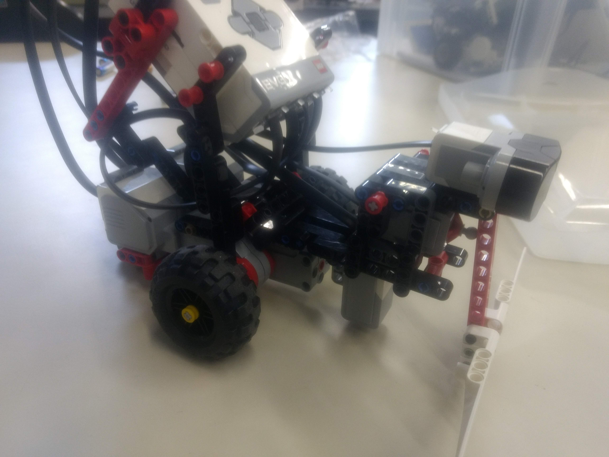
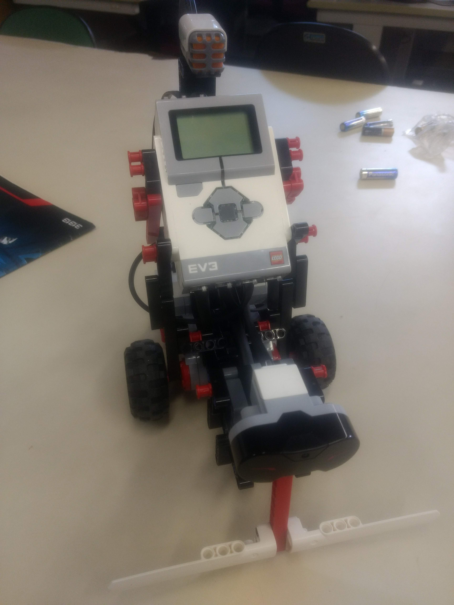
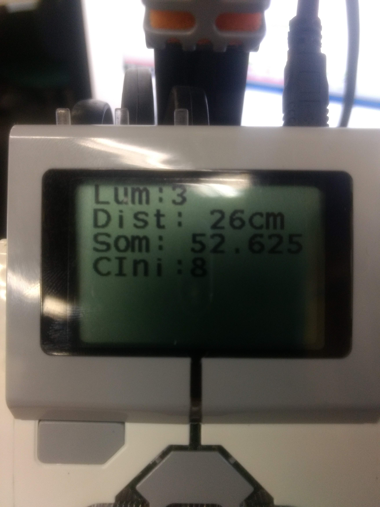

# Concorrência com Lego Mindstorms EV3

Ao iniciar, o robô verifica e salva o valor inicial do sensor de luminosidade. Depois, começa a executar 3 loops:

- O primeiro deles é responsável por verificar continuamente se o botão central foi pressionado ou não, e salvar esse estado em uma variável, a qual é utilizada como condição de parada para os outros 2 loops;
- O segundo é responsável por mover os motores B e C para frente e, ao detectar algum evento de parada (ver seção 1), executar a rotina descrita na seção 2. Após a rotina ser executada, deve-se retornar ao loop;
- O terceiro é responsável por exibir na tela as intensidades luminosas, sonoras e a distância de obstáculos a frente. Também exibe a intensidade inicial do sensor de luminosidade.

## 1. Lista dos eventos que acionam a rotina da seção 2
- sensor de infravermlho identificiar uma distância menor que 50% de sua potência;
- sensor de som identificar um ruído maior que 70%;
- acionamento da chave de liga e desliga localizada na frente do robô;
- sensor de luz identificar uma mudança de cor no chão. Para isso é levado em conta o valor inicial do sensor. Para esse trabalho valores menores que 30% foram considerados tons escuros e maiores, claros.

Vale citar que os valores para todos os sensores devem ser escolhidos levando-se em conta seu posicionamento, luminosidade, sua posição no robô e ruído do ambiente.

## Rotina
- desligar os motores B e C;
- ligar os motores no sentido contrário (para que o robô "engate a ré");
- emitir um bip de 440Hz;
- girar 70 graus a uma potência de 75 para um lado selecionado aleatoriamente;

## Configuração do robô

O robô possui 2 rodas, sensores de toque, som, luminosidade e infravermelho.

| Saídas               | Entradas                   |
|----------------------|----------------------------|
| OUT_B: Roda esquerda | IN_1: Sensor de toque      |
| OUT_C: Roda direita  | IN_2: Sensor sonoro        |
|                      | IN_3: Sensor luminoso      |
|                      | IN_4: Sensor infravermelho |

## Vídeos
- [playlist](https://www.youtube.com/playlist?list=PL-Vy8N4zUqm7ku3F079IFO2XA9thoRVkX)
